# <span style="color:#78909c">Paxxium</span>
### Intro
I started building Paxxium during the backend course of my coding bootcamp right during the time ChatGPT was becoming popular. As soon as I realized there was an API I started building. I didn't know React and had very little experience building out a server with Python and Flask but decided what better way to learn. With that being said, this was a school project, it does work but the code could be crap, I don't know I am still learning. There are basic implementations of all modalities, GPT 3.5/4, GPT-vision, and Dall-e

My over all goal is to create a personalized AI system that know who I am
### Before you start
This is a work in progress, though everything works the client feedback isn't that good right now. If you find that you are asking yourself "is this working?" give it some time. Especially with the News Feature. When you search it is scrapping 10 different news articles then sending each one of those to OpenAI to summarize. This can take a while. 

## Gallery
<table>
  <tr>
    <td>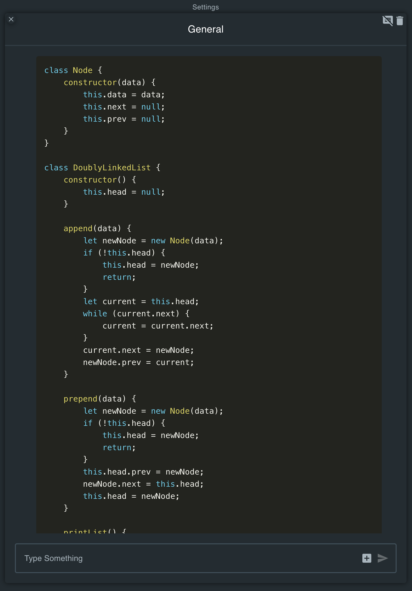</td>
    <td>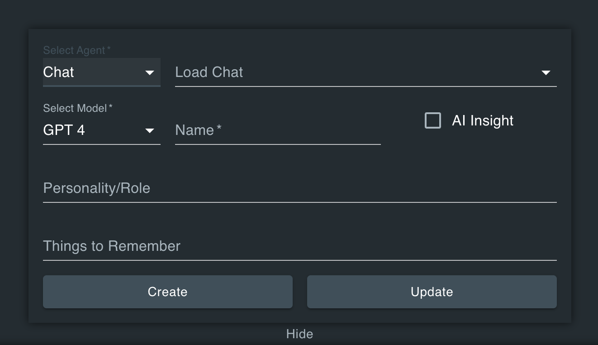</td>
    <td></td>
  </tr>
  <tr>
    <td>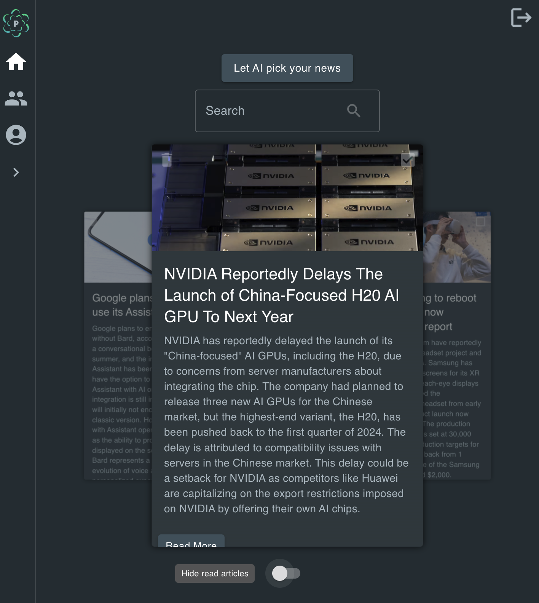</td>
    <td>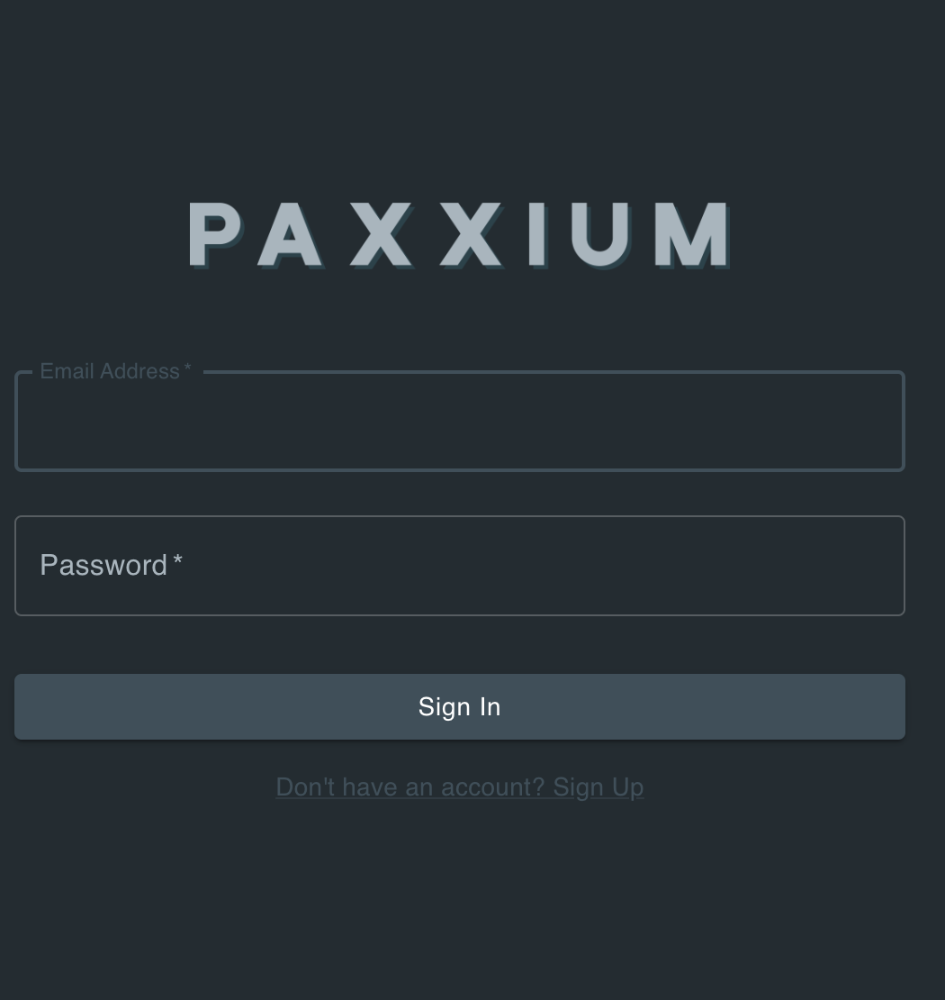</td>
    <td>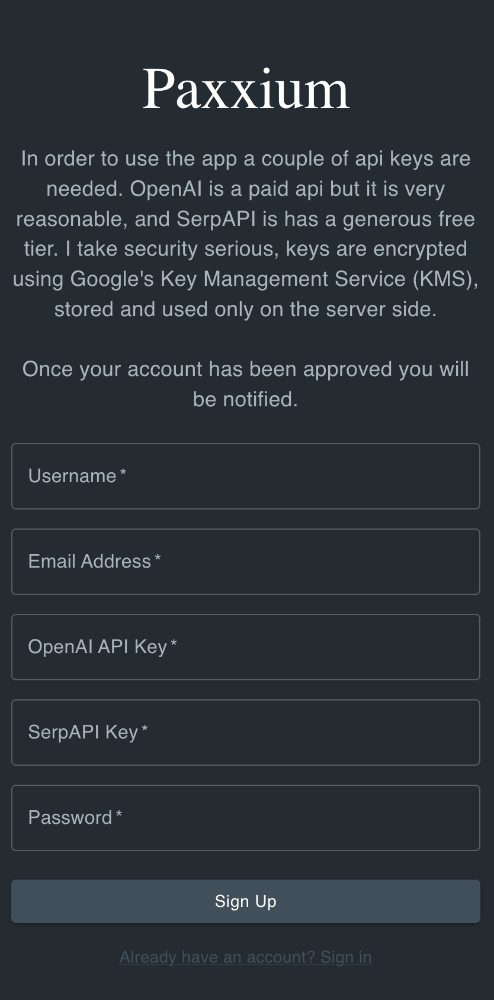</td>
  </tr>
</table>

## Setup Instructions

To get started with Paxxium, you'll need to set up several services. These instructions will guide you through setting up Firebase, Google Cloud, and obtaining necessary API keys. Ensure you have billing accounts set up for paid services like OpenAI.

### Prerequisites
- **Firebase Account**
- **Google Cloud Account**
- **[GNews API Key](https://gnews.io/)**
- **[OpenAI API Key](https://openai.com/product)** (Paid)
- **[SerpAPI Key](https://serpapi.com/)**


**Note:** OpenAI requires a paid account for API access to GPT-4 models.

### Firebase Setup

1. **Create a New Project:**
   - Navigate to Firebase and create a new project. Give it a name and feel free to disable analytics.

     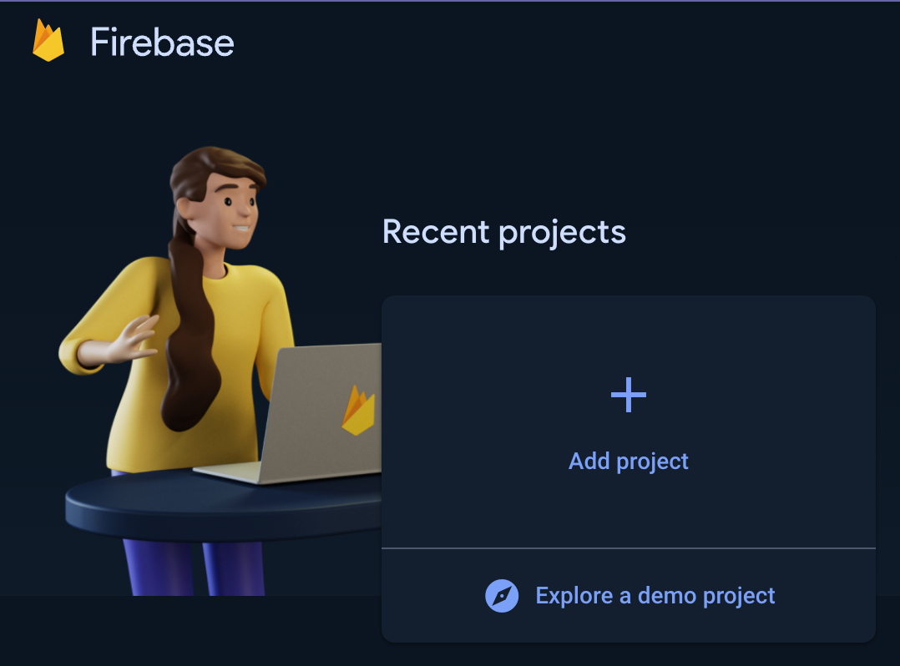

2. **Add a Web App:**
   - Add a new web app to your Firebase project.

     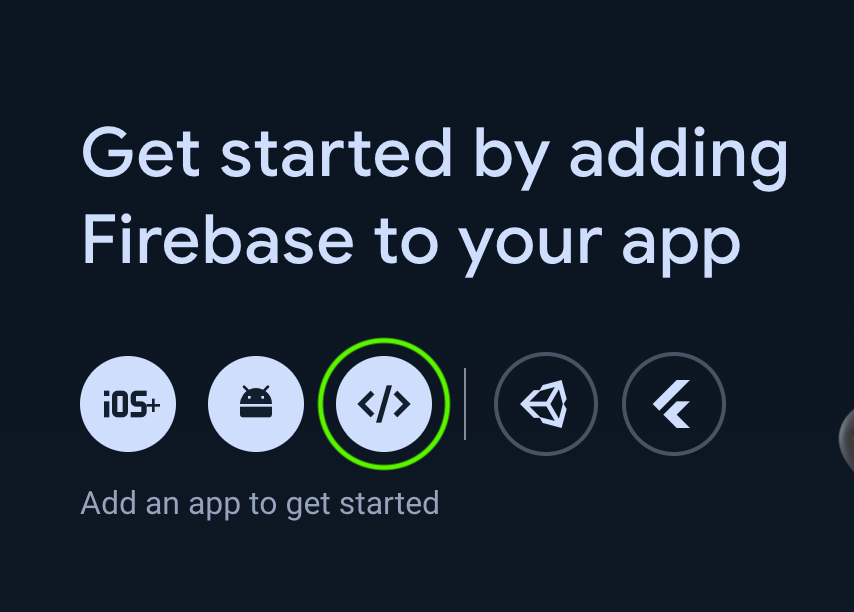

3. **Configuration:**
   - Note the configuration data provided upon creating a new web app. This information will be added to the client-side `.env` file.
     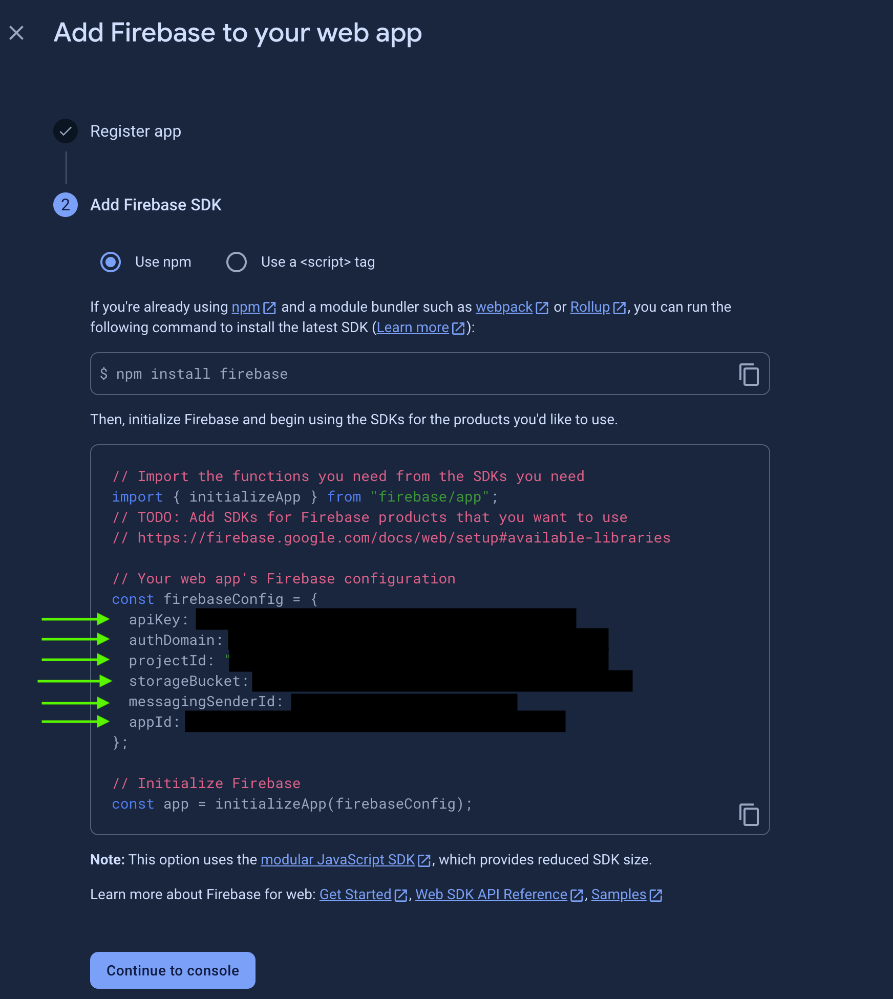

4. **Enable Services:**
   - Go to 'All Products' and add the following services:
     - Authentication (Enable Email/Password)
     - Firestore Database (Not Realtime)
     - Storage

5. **Service Accounts:**
   - Under 'Project Settings' > 'Service Accounts', generate a new private key. This JSON file is for server-side Admin SDK use and should be added to the `fb_config` folder.

### Google Cloud KMS Setup

1. **API Activation:**
   - In Google Cloud Console, ensure your project is selected.
   - Search for `Cloud Key Management Service` and enable the API.
   
     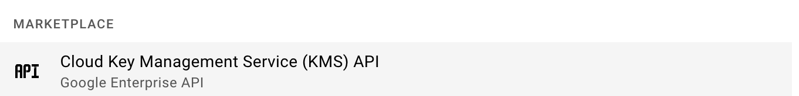

2. **Create a Key Ring and Key:**
   - Navigate to Security > Key Management and create a key ring, then a key within that ring. 
   After you have created the key ring and key copy the resource name for the `KMS_KEY_NAME` variable in the server `.env` file.

     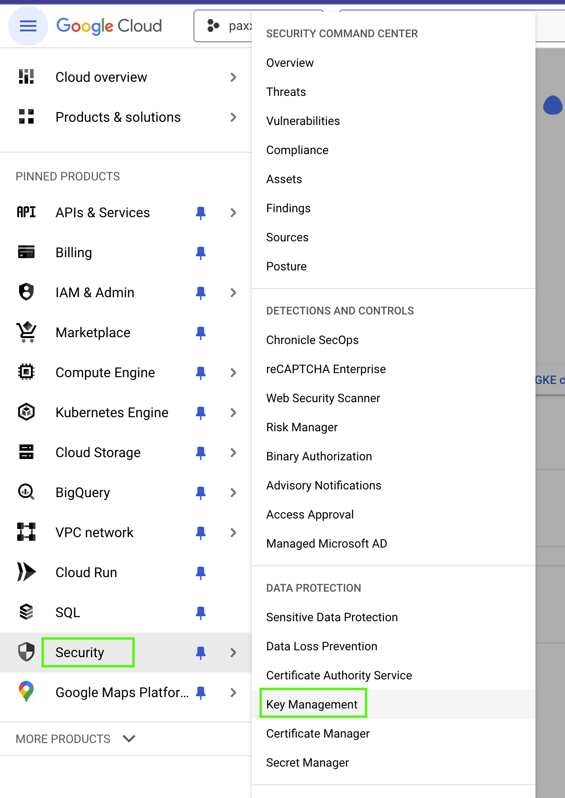

     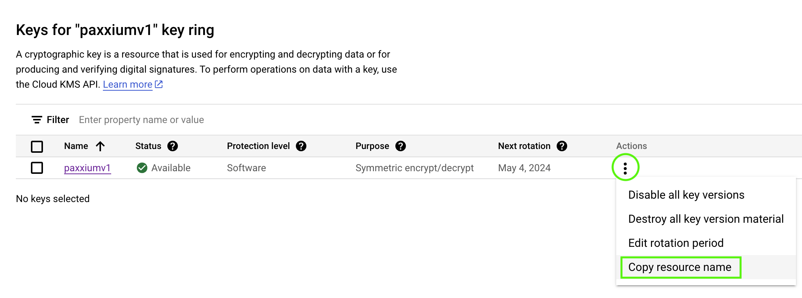

3. **Service Account for KMS:**
   - Under 'IAM & Admin' > 'Service Accounts', create a new service account.
   - Assign the role `Cloud KMS CryptoKey Encrypter/Decrypter`.

     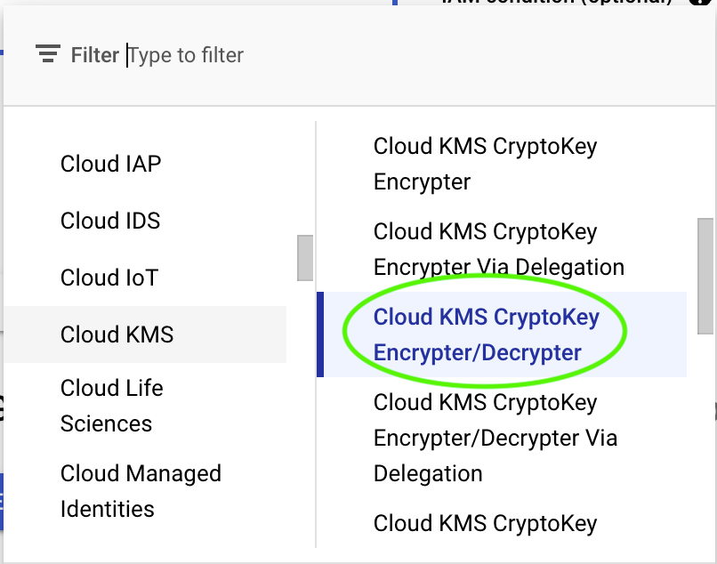
   - Add a key to this account, choosing JSON format. This file is also added to the `fb_config` folder.

     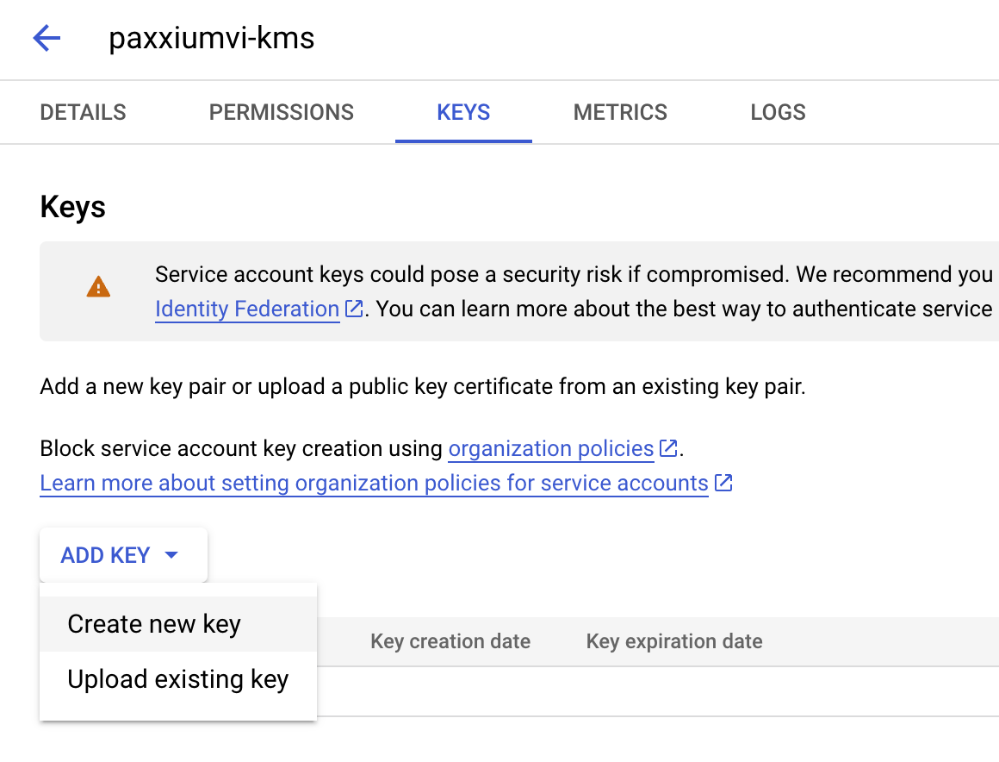


That completes the setup for Firebase and Google Cloud. Next, we can clone the repo and and set up the config we obtained from the previous steps.

## Cloning the Repository

First, clone the Paxxium project repository from GitHub:
[https://github.com/makeiteasierapps/paxxium](https://github.com/makeiteasierapps/paxxium)

## Setting Up Environment Variables

After cloning the project, you will need to set up environment variables for both the client and server sides of the application. This involves creating `.env` files and configuring them with the appropriate values.

### Initial Setup

1. **Create a `.env` file** at the root of the project.
2. **Inside the `/myapp` directory**, create another `.env` file.
3. **Create a `fb_config` folder** inside `/myapp`.
4. **Add the JSON files** you downloaded from Firebase and Google Cloud to the `fb_config` folder.

   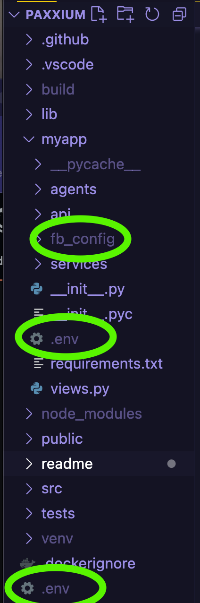 

### Configuring the Client `.env` File

Add the following variables to the client `.env` file, filling in the values obtained from the Firebase setup (Step 3):


```
REACT_APP_FIREBASE_API_KEY=
REACT_APP_FIREBASE_AUTH_DOMAIN=
REACT_APP_FIREBASE_PROJECT_ID=
REACT_APP_FIREBASE_MESSAGING_SENDER_ID=
REACT_APP_FIREBASE_APP_ID=
REACT_APP_BACKEND_URL=http://localhost:5000
```

### Configuring the Server `.env` File

For the server `.env` file, specify the path to your `fb_config` folder and the JSON file for Google application credentials. Use the file that contains 'kms' in the "client_email" field.


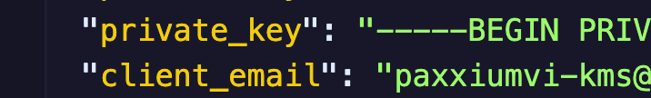


Use the storgae bucket here and add the other JSON file from the `fb_config` folder.
```
GOOGLE_APPLICATION_CREDENTIALS='myapp/fb_config/your_file.json'
KMS_KEY_NAME='the_path_you_copied_from_google_cloud_in_step_2'
GNEWS_API_KEY='your_gnews_api_key'
FIREBASE_STORAGE_BUCKET=
FIREBASE_ADMIN_SDK='myapp/fb_config/your_file.json'
```


## Project Setup Commands

From the root of the project, execute the following commands in your terminal:

1. **Create a virtual environment:** ```python3 -m venv venv```
2. **Activate the virtual environment:** ```. venv/bin/activate```
3. **Install Python dependencies:** ```pip install -r myapp/requirements.txt```
4. **Install client-side dependencies:**```npm i```

## Starting the Application

To start both the client and the server from the root directory, use the following commands:

- **Client:** ```npm start```
- **Server:** ```python run.py```


Once you have the client and server running, you can navigate to `http://localhost:3000` to view the application and create an account. Once you create your account you will need to navigate to your Firebase console and toggle the authorized field to true. I added this step to prevent unauthorized users from using the app. This is for when I decide to host this.

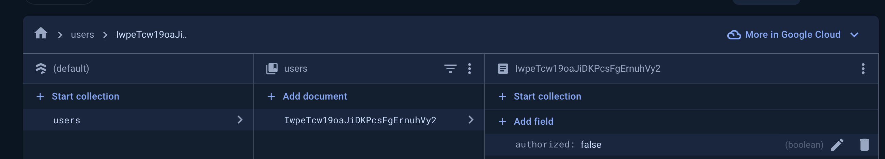
